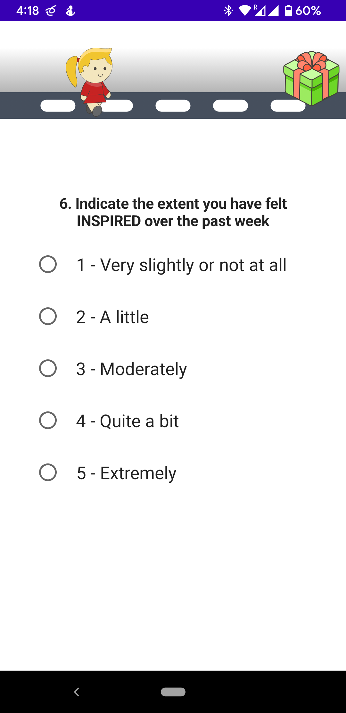
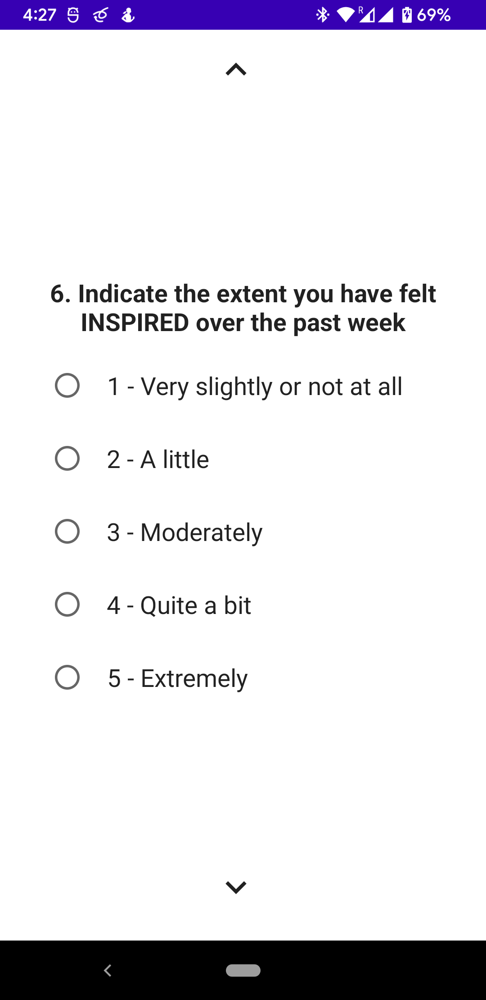

# Can we detect cognitive effort with consumer-grade wearables?

The dataset is divided into two main directories:
- **pilot** – this folder contains data from 11 volunteers that took part in the pilot study (id 0-10).
- **survey_gamification** – this directory contains data from 14 volunteers that took part in the survey gamification experiment (id 11-24). 

Each of the folders contains subfolders with per participant data. Those subfolders are named after the id of the participant.

In the **pilot** study, participants folders have the following subfolders: *baseline*, *cognitive_load*. 

*baseline* – physiological data collected during rest. It contains the following csv files:
- emaptica_bvp.csv - blood volume pulse (BVP, PPG Green) signal from Empatica E4 Watch 
- empatica_eda.csv - Emda signal from Empatica E4 Watch 
- empatica_temp.csv - body surface temperature from Empatica E4 Watch 
- muse_eeg.csv - Delta, Theta, Alpha , Beta and Gamma signals from AF7 (left forhead), AF8 (right forhead), Tp9 (left ear), Tp10 (right ear) 
- samsung_bvp.csv - PPG Green signal from Samsung Galaxy Watch4 

*cognitive_load* – physiological data collected during Stroop task. It contains the following csv files:
- emaptica_bvp.csv 
- empatica_eda.csv 
- empatica_temp.csv 
- muse_eeg.csv 
- samsung_bvp.csv 
- stroop_responses.csv - detailed data collected during the Stroop test 

In the **survey_gamification**  experiment contains per patient folders divided into *pre* and *post* directories containing data for the first and second experiment session, respectively.
*Pre* and *post* directories contain: *baseline* and *cognitive_load* folders described earlier and *survey* directory.

*survey* - physiological data collected during filling the survey. It contains the following csv files: 
- emaptica_bvp.csv 
- empatica_eda.csv 
- empatica_temp.csv 
- muse_eeg.csv 
- samsung_bvp.csv 
- questionnaires.csv  - contains information on which questionnairs were filled and whether they were gamified or not
- responses.csv 

Example of survey screen in both gamified and non-gamified condition. 
The gamified survey has simple game elements such as : progress tracking (avatar moving on a street) and 
rewards for survey completion (present)

